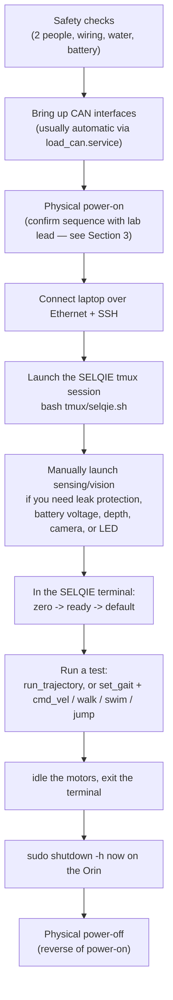
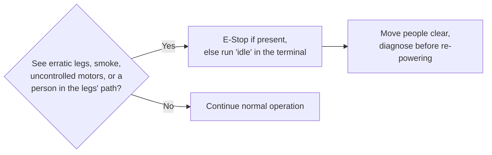
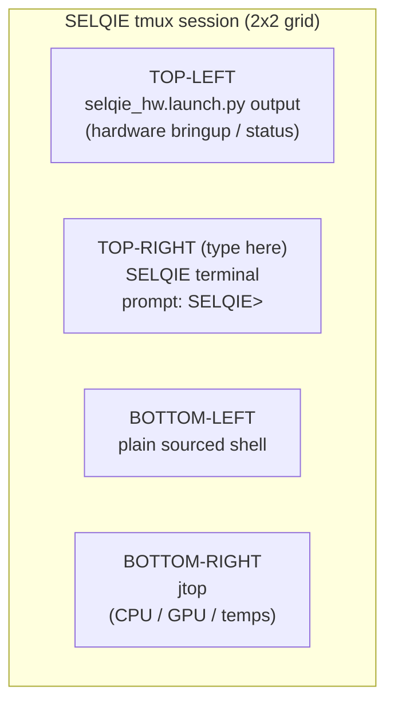
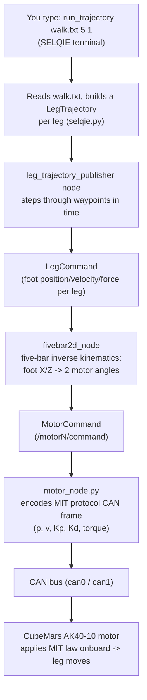

# SELQIE Lite 2 — Standard Operating Procedure

**Version 1.0** — written directly against the `SELQIE_LITE_2` codebase (actuation, leg_control, sensing, ui, selqie_bringup, tools packages) as of this commit. Structured after, and carrying forward the safety philosophy of, the **SELQIE (predecessor robot) SOP V2.0**, kept in this repository at [`docs/SELQIE_SOP_original.pdf`](./SELQIE_SOP_original.pdf).

This edition is written **so that someone with little familiarity with Linux or SELQIE can safely power on, connect to, and operate the robot.** Words in *italics* the first time they appear (e.g. *SSH*, *ROS 2*) are defined in the [Glossary](#12-glossary-of-terms).

> ⚠️ **Golden rule, carried over unchanged from the predecessor SOP:** two trained people should always be present for powering, operating, and testing SELQIE. One person watches the robot, the other works the laptop.

> ⚠️ **This document was written from the software repository, not from a walkthrough of the physical hardware.** Section 0 below explains exactly what changed from the robot the original SOP describes, and flags anywhere this document could not verify a physical detail (battery layout, an E-Stop button, wiring colors) against code. Where it says "confirm with a lab lead," treat that as a real gap, not boilerplate — ask before you rely on it.

## How to use this document

- **First time operating SELQIE Lite 2?** Read Section 0 and Section 1 at minimum before touching hardware.
- **Already trained on the predecessor SELQIE robot?** Read Section 0 (what changed), then skim Sections 5–6.
- **Already trained on SELQIE Lite 2?** Jump to the [One-Page Checklist](#8-one-page-operators-checklist) and the [Terminal Command Reference](#9-selqie-terminal-command-reference).
- **Something went wrong?** Go to [Troubleshooting](#11-troubleshooting).

## Table of Contents

0. [Differences From the Predecessor Robot (SELQIE) — Read This First](#0-differences-from-the-predecessor-robot-selqie--read-this-first)
1. [System Overview at a Glance](#1-system-overview-at-a-glance)
2. [The Operating Lifecycle](#2-the-operating-lifecycle)
3. [Safety Notes](#3-safety-notes)
4. [Computer & Linux Basics](#4-computer--linux-basics)
5. [Bring-Up & Launch Procedure](#5-bring-up--launch-procedure)
6. [Testing Procedure](#6-testing-procedure)
7. [Shutting Down & Powering Off](#7-shutting-down--powering-off)
8. [One-Page Operator's Checklist](#8-one-page-operators-checklist)
9. [SELQIE Terminal Command Reference](#9-selqie-terminal-command-reference)
10. [What Needs to Be Running For a Command to Work](#10-what-needs-to-be-running-for-a-command-to-work)
11. [Troubleshooting](#11-troubleshooting)
12. [Glossary of Terms](#12-glossary-of-terms)
13. [Appendix A — How a Command Reaches a Motor](#13-appendix-a--how-a-command-reaches-a-motor)
14. [Appendix B — Known Documentation/Code Discrepancies](#14-appendix-b--known-documentationcode-discrepancies)

---

## 0. Differences From the Predecessor Robot (SELQIE) — Read This First

The document you may already know, `docs/SELQIE_SOP_original.pdf`, describes an earlier SELQIE robot built around **ODrive Pro controllers driving mjbots MJ5208 motors**, with two labelled batteries (**#2** and **#3**) and a physical **E-Stop** button in the motor-power path. **SELQIE Lite 2 is a different, simpler electromechanical platform sharing the same overall concept** (4-legged, 5-bar-linkage, amphibious). The table below summarizes what actually changed, verified against this repository's code.

| Area | Predecessor SELQIE (original SOP) | SELQIE Lite 2 (this repo, verified in code) |
|---|---|---|
| Motors | 8× mjbots MJ5208 brushless | 8× **CubeMars AK40-10** brushless (`actuation/README.md`) |
| Motor controller | 8× **ODrive Pro** over CAN | Motors run **MIT (Mini Cheetah) protocol onboard** — no separate controller board; the Jetson talks directly to each motor over CAN (`cubemars_v2_ros/motor_node.py`) |
| Leg ↔ CAN bus mapping | FL/RL → `can0`, RR/FR → `can1` | **FL/FR → `can0`, RL/RR → `can1`** — the pairing changed (`selqie_bringup/launch/actuation.launch.py`) |
| Battery monitoring | Two hand-labelled packs (#2, #3), no software voltage read described | Single **TinyBMS** battery management system polled over UART, published as `/tinybms/pack_voltage` and readable from the terminal with `battery` (`battery/battery/tinybms_voltage_uart.py`) |
| Physical E-Stop | A wired E-Stop button in the motor-power harness | **Not present anywhere in this repository's code or docs.** This does not necessarily mean the physical robot has no E-Stop — it means this document cannot verify one exists or where it is. **Confirm with a lab lead before your first session and update this section once confirmed.** |
| Leak protection | 3 leak sensors (front hip, rear hip, body), all wired into `water_shutdown.py` | **1 ROS-integrated leak sensor** (GPIO pin 35, topic `leak/detected`) plus a separate, non-ROS **reed switch** (GPIO pin 38) used for hull-door detection, *not* leak detection. The legacy `water_shutdown.py` script at the repo root still polls 3 raw GPIO pins (35, 22, 38) the old way and is **out of step with the current sensor layout** — see [Section 3.4](#34-water--leak-sensors) and [Appendix B](#14-appendix-b--known-documentationcode-discrepancies). |
| Default sensors running at launch | Implied always-on | **Sensing and vision are NOT started by the default launch** (`selqie_hw.launch.py`) — only motors and leg control come up automatically. This is the single biggest operational difference; see [Section 5](#5-bring-up--launch-procedure). |
| Terminal command set | `zero`, `ready`, `idle`, `clear_errors`, `run_trajectory`, gait shortcuts, `print_*`, recording | All of the above **plus** `battery`, `run_trajectory_record`, `set_led_color`/`led_off`, `latch_open`/`latch_close`, and more — see [Section 9](#9-selqie-terminal-command-reference) |
| Gains / `set_gains` command | Tuned live per-session via ODrive gain-setting | **`set_gains` in the terminal is now a no-op** — CubeMars gains are fixed in `selqie_bringup/launch/actuation.launch.py` and only take effect on relaunch. See [Section 9](#9-selqie-terminal-command-reference). |
| Higher autonomy stack (SBMPO planner, MPC, terrain mapping, EKF localization) | Referenced as the target architecture | **Code exists** (`planning/`, `mpc/`, `mapping/`, `localization/`) but **none of it is included in the default hardware launch** — it must be started manually by a developer. Do not expect `set_goal` to do anything unless you have done this. |

**Net effect for an operator:** the physical safety choreography in the original SOP (battery order, E-Stop, power distribution boards, zeroing guides) may still be exactly correct for your lab's current hardware, or it may not — **this repository does not contain that information**, because it changed with the actuator swap and is not something software can verify. Treat Sections 3 and 5–7 of this document as: *(a)* the parts that are 100% verified against code (the software launch sequence, the terminal commands, the sensor topics), stated with full confidence, and *(b)* the parts carried over from the predecessor SOP as best-practice defaults, explicitly marked, that you should confirm with a lab lead or a maintainer before your first solo session.

---

## 1. System Overview at a Glance

SELQIE Lite 2 is an **amphibious, legged-swimming robot**: it walks on land and swims underwater using four legs. Each leg is a ***five-bar linkage*** driven by two motors, for eight motors total. A single onboard computer runs all of the software.

| Part | What it is | Why you care |
|---|---|---|
| The Orin | An NVIDIA Jetson AGX Orin (JetPack 6.1) — SELQIE's onboard computer, running *ROS 2* Humble. | You connect to it from the laptop to run everything. |
| Motors & legs | 8 **CubeMars AK40-10** brushless motors, each driven directly over CAN using the **MIT (Mini Cheetah)** protocol — no separate motor-controller board. Arranged as 4 two-motor legs. | These are the moving parts. Keep hands clear once motors are `ready`. |
| Battery | A single pack monitored by a **TinyBMS** battery management system over UART. | Powers the whole robot. Read live voltage with the `battery` terminal command (requires `sensing.launch.py` running — see [Section 5](#5-bring-up--launch-procedure)). |
| Sensors | *IMU* (currently disabled in the default launch — see below), Bar100 depth/temperature sensor, stereo/ZED camera, WS2812B status LED, leak sensor, reed switch. | Feed the robot's sense of where it is, how deep it is, and whether it's flooding — **only if their launch file is running.** |
| The laptop | Your control station, connected by an Ethernet *tether*. | Where you type commands. |

### Physical Specifications

| Dimension | Imperial | Metric |
|---|---|---|
| Length | 22 in | 0.5588 m |
| Width | 7.5 in | 0.1905 m |
| Height (body) | 3.5 in | 0.0889 m |

### Leg and Motor Mapping

The four legs are named by their corner of the body. **This mapping is different from the predecessor robot** — verify against `selqie_bringup/launch/actuation.launch.py` if in doubt.

| Leg | Motors | Inner shaft | Outer shaft | CAN bus |
|---|---|---|---|---|
| Front-Left (`FL`) | 0, 1 | 0 | 1 | `can0` |
| Rear-Left (`RL`) | 2, 3 | 2 | 3 | `can1` |
| Rear-Right (`RR`) | 4, 5 | 4 | 5 | `can1` |
| Front-Right (`FR`) | 6, 7 | 6 | 7 | `can0` |

So: **`can0` carries FL + FR, `can1` carries RL + RR.**

### 40-Pin Header (Jetson AGX Orin)

Physical/BOARD pin numbering — the numbering `Jetson.GPIO`'s `GPIO.setmode(GPIO.BOARD)` uses throughout this codebase. "Default Signal" is the pin's stock silkscreen function; SELQIE repurposes several of these as plain digital GPIO in software.

| Pin | Default Signal | Pin | Default Signal |
|----:|-----------------|----:|-----------------|
| 1 | 3.3V | 2 | 5.0V |
| 3 | I2C5_DAT | 4 | 5.0V |
| 5 | I2C5_CLK | 6 | GND |
| 7 | MCLK05 | 8 | UART1_TX |
| 9 | GND | 10 | UART1_RX |
| 11 | UART1_RTS | 12 | I2S2_CLK |
| 13 | GPIO32 | 14 | GND |
| 15 | GPIO27 | 16 | GPIO08 |
| 17 | 3.3V | 18 | GPIO35 |
| 19 | SPI1_MOSI | 20 | GND |
| 21 | SPI1_MISO | 22 | GPIO17 |
| 23 | SPI1_SCK | 24 | SPI1_CS0_N |
| 25 | GND | 26 | SPI1_CS1_N |
| 27 | I2C2_DAT | 28 | I2C2_CLK |
| 29 | CAN0_DIN | 30 | GND |
| 31 | CAN0_DOUT | 32 | GPIO09 |
| 33 | CAN1_DOUT | 34 | GND |
| 35 | I2S_FS | 36 | UART1_CTS |
| 37 | CAN1_DIN | 38 | I2S_SDIN |
| 39 | GND | 40 | I2S_SDOUT |

**Pins SELQIE Lite 2 actually uses:**

| Pin(s) | Used for | Notes |
|---|---|---|
| 29, 31 | Motor CAN bus `can0` (FL, FR) | |
| 33, 37 | Motor CAN bus `can1` (RL, RR) | |
| 18 | Camera / underwater-lights PWM | Reconfigured as PWM5 by `tools/install.sh` |
| 19 | WS2812B status LED data | SPI1_MOSI; MISO/CLK/CS0 (21/23/24) not wired |
| 35 | Leak sensor input | Default label I2S_FS, repurposed as GPIO |
| 38 | Reed switch input (hull-door detection — **not** a leak sensor) | Default label I2S_SDIN, repurposed as GPIO |
| 13 *or* 32 | Hull-latch servo PWM | **Inconsistent in the code:** `servo_node`'s own default and comment say pin 32; `sensing_bringup/launch/servo.launch.py` overrides it to pin 13, so **13 is what actually runs**. Flag for a maintainer — see [Appendix B](#14-appendix-b--known-documentationcode-discrepancies). |

Pins 15 and 16 were the leak sensor's and reed switch's pin assignments in an earlier revision of this codebase; some older reference text still mentions them. The current code uses pins 35 and 38 instead.

---

## 2. The Operating Lifecycle



Keep this picture in mind; the rest of the document walks through each block. The biggest change from the predecessor's lifecycle is the new **F** step — sensing is opt-in, not automatic.

---

## 3. Safety Notes

> Two people should be present for the powering, operation, and testing of SELQIE, per the predecessor SOP's standing rule. This document did not find anything in the code that changes that recommendation, so it carries forward unchanged.

### 3.1 Battery

**Verified from code:** SELQIE Lite 2 is powered from a single battery pack monitored by a **TinyBMS** unit over UART (`battery/battery/tinybms_voltage_uart.py`, topic `/tinybms/pack_voltage`, readable from the terminal's `battery` command). This is a different arrangement from the predecessor's two hand-labelled packs (#2/#3) wired in parallel.

**Not verified from code — confirm with a lab lead:**

- Whether there is more than one physical pack behind the TinyBMS.
- The exact connector/harness sequence for connecting and disconnecting the pack.
- Storage requirements (the predecessor required packs to be unplugged from their parallel harness in storage — check whether an equivalent applies here).

**General practice, unchanged:** inspect the battery for swelling, damage, or abnormally low voltage before use. A damaged lithium battery is a fire hazard — do not use it. Check the terminal's `battery` command (requires `sensing.launch.py` — see [Section 5](#5-bring-up--launch-procedure)) and confirm the voltage is in the expected range for your pack before running any gait.

### 3.2 Emergency Stop (E-Stop)

**This document could not find a physical E-Stop referenced anywhere in the `SELQIE_LITE_2` repository** (code, launch files, or README files) — this is a genuine gap in the documentation, not a claim that no E-Stop exists. **Before your first session, confirm with a lab lead whether SELQIE Lite 2 has a physical E-Stop, where it is, and what it disconnects.** If one exists, follow the predecessor SOP's rule: know where it is *before* applying power, keep the person watching the robot within reach of it at all times, and press it immediately if you see:

- erratic or uncommanded leg movement,
- smoke or a burning smell,
- motors running uncontrollably,
- any person or object inside the legs' range of motion.

If there is **no** hardware E-Stop, the fastest software-level equivalents are, in order of speed:

1. `idle` in the SELQIE terminal (sends `"exit"` to all 8 motors — de-energizes them; see [Section 9](#9-selqie-terminal-command-reference)).
2. `Ctrl+C` / closing the terminal pane, which stops publishing new commands (motors will hold their last state until `cmd_timeout` elapses — 0.5 s by default — then hold passively).
3. Disconnecting motor power at the source, if you know where that is.



### 3.3 Wiring

General practice carried over unchanged from the predecessor SOP: inspect wiring before connecting SELQIE to power. Check for loose connections, dismounted or dangling electrical components, and unintended contact of bare metal. **If you are not 100% confident the wiring looks correct, ask a second person to check behind you. If any suspicion remains, do not power SELQIE.**

### 3.4 Water & Leak Sensors

Because SELQIE Lite 2 is an aquatic robot, inspect it for water intrusion before powering and after any time in the water — visually check the main body and listen for sloshing in each hip enclosure.

**Verified from code — automatic leak protection has changed significantly from the predecessor:**

- The **ROS-integrated leak sensor** lives on GPIO pin 35 (`sensing/leak_sensor`), publishing `true`/`false` on the topic `leak/detected`. **It only runs if `sensing.launch.py` is running** — it is not started by the default hardware launch. See [Section 5](#5-bring-up--launch-procedure).
- GPIO pin 38, which the predecessor robot used as a second leak sensor ("Body"), is now wired to the **reed switch** (`sensing/reed_switch`), used for hull-door/deployment detection — **not** leak detection.
- The standalone `water_shutdown.py` script at the repository root is a holdover from the predecessor robot. It does **not** use ROS at all — it polls GPIO pins **35, 22, and 38 directly** with the `Jetson.GPIO` library and calls `sudo shutdown -h now` if any reads HIGH, logging to `/var/log/water_shutdown.log`. It is **not installed as a running service by `tools/install.sh`** — it only runs if someone has manually set it up as a `systemd` service per the instructions in its own file header.

> ⚠️ **Known safety-relevant discrepancy.** `water_shutdown.py` still treats pin 38 as a "Body" leak sensor. On this platform, pin 38 is wired to the reed switch, not a leak sensor. If `water_shutdown.py` is running as a service on your robot, opening/closing the hull door (or any other reed-switch activity on pin 38) could trigger an unwanted full shutdown, and there is no software leak check left covering whatever was previously on pin 22. **Before you rely on automatic leak shutdown, run `systemctl status water_shutdown.service` on the Orin to see if it's active, and have a maintainer reconcile this script with the current pin assignments** (see [Appendix B](#14-appendix-b--known-documentationcode-discrepancies)). Until that's resolved, treat the leak sensor on pin 35 (`leak/detected`, via `sensing.launch.py`) as your primary automatic protection, and rely on visual/audible inspection as a backup.

> ⚠️ **If the Orin shuts down unexpectedly at any time, assume a leak.** Retrieve SELQIE from the water if applicable, then check `/var/log/water_shutdown.log` on the Orin once you reconnect (if the service is installed) and inspect the hull for water before repowering.

---

## 4. Computer & Linux Basics

*(Skip this section if you are comfortable with a Linux terminal and SSH.)*

You will control SELQIE from a laptop by typing text commands into a terminal.

- Lines that start with `>` in this document are commands **you type**, then press Enter. Do not type the `>` itself.
- ***SSH*** (Secure Shell) is how the laptop "logs in" to the Orin over the Ethernet cable so that commands you type run *on the robot's computer*, not on the laptop. Per `docs/JetsonAGX-Setup.md`, the Orin's user account is `selqie`; connect with:
  ```
  ssh selqie@<jetson-ip-or-hostname>
  ```
  Ask a lab member for the current IP address or hostname if `ssh selqie` (a short alias) isn't already configured on your laptop.
- `sudo` means "run this as the administrator." It will ask for a password. A password prompt does not show characters as you type — this is normal.
- The Orin's user password is the lab password. It is intentionally not written in this repository — ask a lab member if you don't have it.
- Copy/paste in most Linux terminals is `Ctrl+Shift+C` / `Ctrl+Shift+V` (not `Ctrl+C` — inside a terminal, `Ctrl+C` stops the running program).

Two more terms you'll see constantly:

- ***ROS 2*** — the "Robot Operating System," the software framework SELQIE runs on (Humble release). It is organized as many small programs (*nodes*) that pass messages on named channels (*topics*). You don't need to manage these directly; the launch files start them for you.
- ***tmux*** — a tool that splits one terminal window into several panes so you can see the robot's status, the control console, and system stats at once.

---

## 5. Bring-Up & Launch Procedure

This section replaces the predecessor SOP's "Step 2/3/4" — the underlying software changed enough that the steps are worth restating in full.

### 5.1 CAN interfaces

Motors talk over two SocketCAN interfaces, `can0` and `can1`, at 1 Mbit/s. On a properly-installed robot these come up automatically at boot via the `load_can.service` systemd unit (installed by `tools/install.sh`, which runs `tools/loadcan_jetson.sh`). Verify they're up:

```
ip link show can0
ip link show can1
```

Both should show `UP`. If not:

```
sudo systemctl status load_can.service
sudo ./loadcan_jetson.sh      # from tools/, to bring them up manually
```

### 5.2 Launch the tmux session

From the Orin, in the workspace root:

```
bash ~/selqie_ws/src/SELQIE_LITE_2/tmux/selqie.sh
```

This opens a 2×2 `tmux` grid, matching the predecessor robot's layout:



| Pane | Runs | You use it to… |
|---|---|---|
| Top-left | `ros2 launch selqie_bringup selqie_hw.launch.py` (after checking `python3-can` is installed) | Watch that nodes start without errors. |
| Top-right ★ | `ros2 run selqie_ui selqie_terminal` | Type all robot commands here, at the `SELQIE>` prompt. |
| Bottom-left | A sourced shell (`source install/setup.bash`) | Run extra `ros2` commands, `candump`, manual launches (see 5.3), or the Orin shutdown command. |
| Bottom-right | `jtop` | Watch CPU/GPU load and temperature. |

Tmux tips: mouse is enabled (click a pane to select it, scroll for history); `Ctrl+b` then an arrow key moves between panes by keyboard; `Ctrl+b` then `x` sends an interrupt to every pane and closes the session cleanly (configured in `tmux/.tmux.conf`).

### 5.3 ⚠️ Sensing and vision are NOT started automatically — enable them if you need them

This is the most important operational difference from the predecessor robot. Look at `selqie_bringup/launch/selqie_hw.launch.py`:

```python
LaunchFile('actuation.launch.py'),
# LaunchFile('sensing.launch.py'),
# LaunchFile('vision.launch.py'),
LaunchFile('leg_control.launch.py'),
# LaunchFile('mapping.launch.py'),
# LaunchFile('planning.launch.py'),
#LaunchFile('tf.launch.py'),
#LaunchFile('localization.launch.py'),
#LaunchFile('marker_localization.launch.py'),
```

**Only `actuation.launch.py` (motors + CAN) and `leg_control.launch.py` (kinematics + gaits) start by default.** That means, unless you take the extra step below, the following are all **silently unavailable** during your session:

- the ROS-integrated **leak sensor** (`leak/detected`),
- the reed switch,
- **battery voltage** reporting (the `battery` command will print "No battery voltage messages received yet."),
- depth/temperature (Bar100),
- the status LED,
- the hull-latch servo,
- the camera and underwater lights.

**To turn these on for a session**, run this in the bottom-left (sourced shell) pane, or a new terminal SSHed into the Orin:

```
ros2 launch selqie_bringup sensing.launch.py    # leak sensor, reed switch, Bar100, LED, servo, battery
ros2 launch selqie_bringup vision.launch.py     # camera + underwater lights
```

Leave these running in their own terminal/pane for the duration of the session. If your lab wants these on by default, a maintainer should uncomment the relevant lines in `selqie_hw.launch.py` and rebuild — see [Appendix B](#14-appendix-b--known-documentationcode-discrepancies).

The IMU (`sensing/sensing_bringup/launch/imu.launch.py`) is commented out inside `sensing.launch.py` itself, separately from the above — it needs hardware and udev rules confirmed working before enabling (`sensing/README.md`).

---

## 6. Testing Procedure

### Step 1 — Zero the motors

Legs should be supported (by hand, a stand, or a mechanical jig if your lab has one) before this step, the same way the predecessor SOP used clip-on zeroing guides — **this document could not verify whether an equivalent physical jig exists for SELQIE Lite 2; ask a lab lead.** The safety reason is unchanged: you want the legs at a known, safe position before motors go live.

In the SELQIE terminal:

```
> zero
```

This sends the CubeMars `ZERO` special command to all 8 motors, which sets each motor's *current* physical position as its new encoder zero (`cubemars_v2_ros/motor_node.py`, `on_special`). It does **not** move the motors — it only re-labels wherever they currently are as "0." Make sure the legs are actually in your desired zero pose before running this.

### Step 2 — Ready the motors

Confirm legs are clear of wires, hands, tools, and obstacles, then:

```
> ready
```

This sends `"start"` to all 8 motors, which arms MIT closed-loop control — **motors energize and immediately begin servoing toward whatever position is currently commanded** (governed by the `position_kp`/`position_kd` gains baked into `selqie_bringup/launch/actuation.launch.py` at launch time). **Keep hands clear from this point on — the legs are live.**

### Step 3 — Move to the default stance (optional but recommended)

```
> default
```

Commands all four legs to the default foot position (`x=0, y=0, z=-0.18914` m below the hip — the fixed "stance" pose used throughout the stride-generation config).

### Step 4 — (Optional) Start data recording

```
> start_recording
```

Starts a *ROS bag* capturing motor state, leg state, camera images, IMU, depth, battery voltage, gait/velocity commands, odometry, LED, and servo topics (`ui/selqie_python/selqie_python/selqie.py`, `ROSBAG_RECORD_TOPICS`). Bags are saved on the Orin under:

```
/home/selqie/rosbags/<YYYY-MM-DD-HH-MM-SS>[_<tag>]
```

If you'd rather record and run a trajectory in one step, skip ahead to `run_trajectory_record` in Section 9 — it starts recording, runs the trajectory, and stops recording automatically, tagging the bag filename with the gait/frequency/loop count.

### Step 5 — Move the robot

SELQIE Lite 2 supports **two independent ways to move**, both of which existed in the predecessor robot but are worth restating clearly:

**A. Feed-forward trajectory playback** — replays a pre-recorded file of leg commands, open-loop:

```
> run_trajectory <file> <# loops> <hz>
```

- `<file>` — one of `walk.txt`, `jump.txt`, `crawl.txt`, `swim.txt`, `walk_20cm_stride.txt` (`leg_control/leg_trajectory_publisher/trajectories/`). Tab-completes in the terminal.
- `<# loops>` — how many times to repeat it (whole number).
- `<hz>` — playback rate in hertz; higher = faster/more aggressive.

Example — walk in place for 5 loops at 1 Hz:

```
> run_trajectory walk.txt 5 1
```

You can chain multiple trajectories in one call: `run_trajectory walk.txt 5 1 jump.txt 2 0.5`.

**B. Closed-loop gaits** — the stride-generation nodes compute leg motion live from a velocity command:

```
> set_gait walk
> cmd_vel 0.1 0.0 0.0
```

or use the shortcuts, which set the gait and send velocity in one call:

```
> walk <lin_x> <ang_z>
> swim <lin_x> <lin_z>
> jump <lin_x> <lin_z>
> stand
> sink
```

> **Start conservative either way.** For a first run on a new gait or trajectory, use a low loop count/velocity and a low frequency, and watch for erratic motion. If a physical E-Stop exists on your robot, keep a hand near it; otherwise be ready to type `idle`.

### Step 6 — Stop, exit

```
> stop_recording      # if you started recording separately
> idle                 # de-energize all motors
> exit                 # leaves the terminal, shuts down its ROS node
```

---

## 7. Shutting Down & Powering Off

1. In the SELQIE terminal: `idle`, then `exit`.
2. In a plain terminal (bottom-left pane works well), cleanly shut down the Orin's computer so nothing is corrupted:
   ```
   > sudo shutdown -h now
   ```
   Enter the lab password when prompted. Wait for the Orin to finish powering down (indicator lights/fans go quiet) before removing power.
3. **Physical power-off order:** the predecessor SOP's rule — motor power off first, then logic power off, the reverse of power-on — is a sound general practice and this document did not find anything in the code that contradicts it. **This document could not verify the exact physical steps (battery harness, distribution boards) for SELQIE Lite 2's current wiring; confirm with a lab lead** and update this section once confirmed for your hardware.

---

## 8. One-Page Operator's Checklist

*Print this.*

**Power ON**

- [ ] 2 trained people present
- [ ] Physical E-Stop location confirmed with a lab lead (or confirmed there isn't one, and you know `idle` is your fallback)
- [ ] Wiring inspected (no loose/bare/dismounted connections)
- [ ] No water in body or hips (look + listen)
- [ ] Legs supported/braced before motors go live
- [ ] Physical battery/power-on sequence per your lab's current procedure
- [ ] CAN interfaces up: `ip link show can0` / `can1` → `UP`

**Connect & Launch**

- [ ] Ethernet tether connected, strain-relieved
- [ ] `ssh selqie@<ip>` → lab password
- [ ] `bash ~/selqie_ws/src/SELQIE_LITE_2/tmux/selqie.sh`
- [ ] Top-left pane shows nodes starting without errors
- [ ] **If you need leak protection, battery voltage, depth, camera, or LED:** `ros2 launch selqie_bringup sensing.launch.py` (and `vision.launch.py` for camera/lights) in another pane

**Run a Test** (SELQIE terminal, top-right)

- [ ] `zero` (legs supported/braced)
- [ ] Confirm legs clear of everything
- [ ] `ready` (hands clear — legs are live)
- [ ] `default` (move to stance)
- [ ] `start_recording` (optional) or use `run_trajectory_record`
- [ ] `run_trajectory <walk|jump|crawl|swim>.txt <loops> <hz>` **or** `set_gait <walk|swim|jump|stand|sink>` + `cmd_vel <x> <z> <ang_z>` — start low!
- [ ] `stop_recording` (if recording separately)
- [ ] `idle`, then `exit`

**Power OFF**

- [ ] `sudo shutdown -h now` → wait for the Orin to power down
- [ ] Physical power-off, reverse of power-on order, per your lab's current procedure

---

## 9. SELQIE Terminal Command Reference

Every command is typed at the `SELQIE>` prompt (`ros2 run selqie_ui selqie_terminal`). Type `help` to list them, `help <command>` for its one-line description. This table is generated directly from `ui/selqie_ui/selqie_ui/selqie_terminal.py` — it is the complete command set, including several not present in the predecessor robot's SOP.

### Motor & leg setup

| Command | Arguments | What it does |
|---|---|---|
| `zero` | — | Set each motor's current position as its encoder zero. |
| `ready` | — | Enable (arm) all 8 motors in closed-loop MIT mode. Legs go live. |
| `idle` | — | Disable all 8 motors (de-energized, free to move by hand). |
| `clear_errors` | — | Clear CubeMars fault state on all motors. |
| `default` | — | Move all 4 legs to the default stance position (`0, 0, -0.18914`). |
| `set_motor_position` | `<motor 0-7> <pos_rad>` | Command a single motor to a position, in radians. |
| `set_gains` | `<kp> <kd>` | **No-op as of this version.** Logs a warning and does nothing — CubeMars gains are fixed per-motor in `selqie_bringup/launch/actuation.launch.py` and only change on relaunch. Kept for command-set compatibility with the predecessor robot. |
| `set_leg_position` | `<leg\|*> <x> <y> <z>` | Command one leg (`FL`/`RL`/`RR`/`FR`) or all (`*`) to a Cartesian foot position, in meters. |
| `set_leg_force` | `<leg\|*> <x> <y> <z>` | Command one leg or all to a Cartesian foot force, in newtons. |
| `print_motor_info` | — | Print live position/velocity/torque/current/temperature/error for every motor. |
| `print_leg_info` | — | Print live position/velocity/force estimate for every leg. |
| `print_errors` | — | List any active motor fault by name. |

### Feed-forward trajectories

| Command | Arguments | What it does |
|---|---|---|
| `run_trajectory` | `<file> <loops> <hz> [<file2> <loops2> <hz2> ...]` | Play one or more trajectory files open-loop. Tab-completes filenames. |
| `run_trajectory_record` | same as above | Same as `run_trajectory`, but automatically starts a rosbag before the run and stops it after, tagging the filename with gait/frequency/loop count. Refuses to start if already recording. |

### Closed-loop gaits (stride generation)

| Command | Arguments | What it does |
|---|---|---|
| `set_gait` | `<walk\|swim\|jump\|sink\|stand\|none>` | Select the active gait mode on the `gait` topic. |
| `cmd_vel` | `<lin_x> <lin_z> <ang_z>` | Send a velocity command to the active gait. |
| `walk` | `<lin_x> <ang_z>` | Shortcut: set gait to walk, then drive. |
| `swim` | `<lin_x> <lin_z>` | Shortcut: set gait to swim, then drive. |
| `jump` | `<lin_x> <lin_z>` | Shortcut: set gait to jump, then drive. |
| `stand` | — | Shortcut: stand in place. |
| `sink` | — | Shortcut: controlled sink, zero velocity. |
| `set_goal` | `<x> <y> <theta>` | Publish an autonomous goal pose. **Only does anything if the planning stack is separately running — not started by default.** See [Section 10](#10-what-needs-to-be-running-for-a-command-to-work). |

### Data, sensors & utilities

| Command | Arguments | What it does | Needs |
|---|---|---|---|
| `battery` | — | Print latest battery voltage and its age. | `sensing.launch.py` |
| `start_recording` / `stop_recording` | — | Start/stop a rosbag of key topics → `/home/selqie/rosbags/<timestamp>`. | — |
| `set_light_brightness` | `<0-100>` | Set underwater light brightness, percent. | `vision.launch.py` |
| `set_led_color` | `<r 0-255> <g> <b>` | Set the WS2812B status LED color. | `sensing.launch.py` |
| `led_off` | — | Turn the status LED off. | `sensing.launch.py` |
| `latch_open` / `latch_close` | — | Open/close the hull-latch servo. | `sensing.launch.py` |
| `calibrate_imu` | — | Trigger IMU calibration (hold the robot still). | IMU hardware + `imu.launch.py` enabled |
| `reset_localization` | — | Reset the pose estimate to the origin. | `localization.launch.py` |
| `reset_map` | — | Clear the terrain map. | `mapping.launch.py` |
| `exit` | — | Leave the terminal and shut down its ROS node. | — |

---

## 10. What Needs to Be Running For a Command to Work

Because sensing, vision, mapping, planning, and localization are **all** off by default (Section 5.3), a command that looks like it failed may simply have nothing listening on the other end. Use this table to check before troubleshooting further:

| You want to… | Launch file needed | Started by default? |
|---|---|---|
| Move motors/legs, run trajectories, drive gaits (`walk`, `swim`, `jump`, `stand`, `sink`, `cmd_vel`, `set_leg_position`, `set_leg_force`) | `actuation.launch.py` + `leg_control.launch.py` | **Yes** |
| Read battery voltage (`battery`) | `sensing.launch.py` (includes `battery/tinybms_voltage_uart.launch.py`) | No — launch manually |
| Automatic leak shutdown, reed switch state | `sensing.launch.py` | No — launch manually |
| Depth/temperature (Bar100) | `sensing.launch.py` | No — launch manually |
| Status LED (`set_led_color`, `led_off`) | `sensing.launch.py` | No — launch manually |
| Hull latch (`latch_open`, `latch_close`) | `sensing.launch.py` | No — launch manually |
| Underwater lights (`set_light_brightness`) | `vision.launch.py` | No — launch manually |
| Camera image topics | `vision.launch.py` | No — launch manually |
| IMU data, `calibrate_imu` | `sensing.launch.py` with `imu.launch.py` uncommented, hardware connected | No — commented out even within `sensing.launch.py` |
| `reset_localization`, robot pose/odometry (EKF) | `localization.launch.py` | No — launch manually |
| `reset_map`, terrain map | `mapping.launch.py` | No — launch manually |
| `set_goal`, autonomous path planning | `planning.launch.py` (and, in turn, `localization.launch.py` + `mapping.launch.py` for it to be useful) | No — launch manually |
| Static TF tree (`base_link`, `imu_link`, camera frames) | `tf.launch.py` | No — launch manually |

---

## 11. Troubleshooting

| Symptom | Likely cause / what to do |
|---|---|
| Orin shut down by itself | Treat as a possible leak. Retrieve SELQIE from the water if applicable. Check `/var/log/water_shutdown.log` if the legacy service is installed (`systemctl status water_shutdown.service`). Remember it currently double-checks pin 38 (reed switch), not just leak sensors — see [Section 3.4](#34-water--leak-sensors). |
| `ssh selqie@<ip>` fails / times out | Check the Ethernet tether and adapter are seated; confirm the Orin actually booted; double check the IP/hostname with a lab member. |
| Password rejected | Characters don't show while typing — that's normal. Re-type carefully. |
| `run_trajectory`, `ready`, or `zero` produce no motion | Motors may not be energized (`ready` first) or in a fault state (`print_errors`, then `clear_errors`). Confirm `ip link show can0`/`can1` are `UP`. Confirm `actuation.launch.py` and `leg_control.launch.py` are actually running (top-left pane, no errors). |
| `battery` says "No battery voltage messages received yet." | `sensing.launch.py` isn't running — see [Section 5.3](#53--sensing-and-vision-are-not-started-automatically--enable-them-if-you-need-them). |
| `set_led_color` / `led_off` do nothing | `sensing.launch.py` isn't running, or SPI isn't enabled — re-run `tools/install.sh` (it configures SPI1 via `config-by-function.py`) and reboot. |
| `set_gains` doesn't seem to change anything | It's a no-op by design in this version — edit `INNER_KP`/`OUTER_KP`/etc. in `selqie_bringup/launch/actuation.launch.py` and relaunch instead. |
| `set_goal`, `reset_map`, `reset_localization`, `calibrate_imu` do nothing | The corresponding subsystem (planning/mapping/localization/IMU) isn't launched by default — see [Section 10](#10-what-needs-to-be-running-for-a-command-to-work). |
| Legs jump/snap when running `ready` | Motors immediately servo toward whatever position was last commanded — if that's stale or zero and the legs weren't there, they'll move. Support the legs, `idle`, `zero` again with legs at the pose you want, then `ready`. |
| Motors fault repeatedly (`print_errors` shows faults) | Run `clear_errors`. If it persists, check CAN wiring and battery voltage; verify `candump can0` / `candump can1` show traffic. |
| A leg moves the wrong direction | Check the `flip_y` setting for that leg in `leg_control/leg_control_bringup/launch/fivebar.launch.py` (called from `selqie_bringup/launch/leg_control.launch.py`) and the `reverse_polarity` setting for its motors in `selqie_bringup/launch/actuation.launch.py`. Note the current known discrepancy in [Appendix B](#14-appendix-b--known-documentationcode-discrepancies) — inner-shaft motors are not actually launched with `reverse_polarity=true` despite that being the documented intent. This is a maintainer/config issue, not something to fix mid-session. |
| Stale motion continues after a gait stops | `cmd_timeout` (default 0.5 s in `cubemars.launch.py`) is how long a motor holds the last command before zeroing it and holding passively. If this feels too long/short, a maintainer can adjust it. |
| `candump can0`/`can1` shows nothing | CAN interface likely down — `sudo systemctl status load_can.service`, or bring it up manually with `tools/loadcan_jetson.sh`. |
| `python-can` import error when launching | `sudo apt install python3-can` |
| Something looks wrong and you're unsure | Stop. `idle` the motors (or E-Stop, if present). Ask a second person. When in doubt, power down. |

---

## 12. Glossary of Terms

| Term | Definition |
|---|---|
| Amphibious | Able to operate both on land and in water. SELQIE walks and swims. |
| AK40-10 | The CubeMars brushless motor model used for all 8 joints on SELQIE Lite 2 (T_MAX = 5 Nm). |
| Bar100 | A Blue Robotics pressure sensor used to measure water depth and temperature. |
| Brushless motor | An efficient electric motor with no brushes. SELQIE Lite 2 uses CubeMars AK40-10 motors, which run their control loop onboard (unlike the predecessor's ODrive-driven motors). |
| CAN / CAN bus | *Controller Area Network* — the wiring/protocol that carries commands between the Orin and each motor. SELQIE Lite 2 uses two: `can0` (FL, FR) and `can1` (RL, RR). |
| Closed-loop control | The motor actively senses its position and corrects to hold/track a target. The `ready` command arms this mode. |
| `cmd_timeout` | A per-motor safety timer (default 0.5 s): if no new command arrives in that window, the motor node zeros its cached command and holds passively. |
| E-Stop (Emergency Stop) | A physical button that cuts motor power immediately. **Not confirmed to exist on SELQIE Lite 2** — see [Section 3.2](#32-emergency-stop-e-stop). |
| EKF (Extended Kalman Filter) | The math that fuses IMU, depth, and other sensors into one best-guess estimate of the robot's position/orientation. Implemented in `localization/`, not launched by default. |
| Feed-forward / open-loop | Playing a pre-planned motion (a trajectory file) without correcting from sensor feedback. `run_trajectory` is feed-forward. |
| Five-bar linkage | The two-motor leg mechanism SELQIE uses; two motor angles determine the foot's X/Z position, computed by the `fivebar2d_node`. |
| `flip_y` | A per-leg kinematics setting that mirrors the Y-axis so left-side legs (`FL`, `RL`) share the same kinematic model as right-side legs (`RR`, `FR`). |
| Gait | A pattern of leg motion for locomotion: `walk`, `swim`, `jump`, `sink`, `stand` (closed-loop), or a trajectory file like `crawl.txt` (feed-forward). |
| GPIO | *General-Purpose Input/Output* — the Orin's electrical pins, used here for the status LED (output, SPI), lights/servo (PWM output), and leak/reed sensors (digital input). |
| Host name | The network name of a computer. The Orin's user account is `selqie`; connect with `ssh selqie@<ip>`. |
| IMU | Inertial Measurement Unit (MicroStrain 3DM-CV7) — measures orientation, rotation rate, and acceleration. Currently commented out of the default sensing launch. |
| `jtop` | A monitor for NVIDIA Jetson boards showing CPU/GPU usage, temperature, and power (the bottom-right tmux pane). |
| Leak sensor | A GPIO probe (pin 35) that detects water inside the robot, publishing to `leak/detected`. Only active if `sensing.launch.py` is running. |
| MIT protocol / Mini Cheetah protocol | The CAN command format used by CubeMars motors: `τ = Kp × (p_des − p_meas) + Kd × (v_des − v_meas) + τ_ff`, applied onboard the motor with no external filtering. Replaces the predecessor's ODrive-based control. |
| Node | A single ROS 2 program. Many nodes run at once to operate SELQIE. |
| Orin | The NVIDIA Jetson AGX Orin — SELQIE's onboard computer. |
| Reed switch | A GPIO probe (pin 38) that detects a nearby magnet — used for hull-door/deployment detection, not leak detection. |
| ROS 2 (Robot Operating System 2) | The software framework SELQIE runs on. SELQIE Lite 2 uses the Humble release. |
| ROS bag | A recorded file of ROS messages (telemetry, images, commands) captured with `start_recording`/`run_trajectory_record` for later analysis. |
| SBMPO | *Sampling-Based Model Predictive Optimization* — a graph-search planner package present in this repo (`planning/`) but not part of the default launch. |
| SSH (Secure Shell) | A secure way to log in to and run commands on the Orin from the laptop. |
| Stance position | The default standing pose of the legs (foot at `z ≈ −0.18914` m below the hip) — unchanged in value from the predecessor robot. |
| Stride generation | The five ROS 2 nodes (`walk_stride_node`, `swim_stride_node`, `jump_stride_node`, `sink_stride_node`, `stand_stride_node`) that turn a gait + velocity command into per-leg foot trajectories. |
| `sudo` | "Superuser do" — run a command with administrator privileges (asks for a password). |
| Tether | The cable (Ethernet here) connecting SELQIE to the laptop. Protect it from strain. |
| TinyBMS | The battery management system monitoring SELQIE Lite 2's pack over UART, reporting voltage on `/tinybms/pack_voltage` (there is no separate `/battery/voltage` topic, despite some README references to one). |
| tmux | A terminal multiplexer that splits one window into panes; the launch script uses a 2×2 layout, unchanged from the predecessor robot. |
| Topic | A named channel that ROS 2 nodes use to publish/subscribe messages (e.g. `motor0/command`). |
| Trajectory file | A text file describing a sequence of leg commands over time (`walk.txt`, `jump.txt`, `crawl.txt`, `swim.txt`, `walk_20cm_stride.txt`). |
| WS2812B | The addressable RGB status LED, driven over SPI, set with `set_led_color`/`led_off`. |
| Zeroing | Setting a motor's *current physical position* as its encoder's "0" reference (the `zero` command). Does not move the motor. |

---

## 13. Appendix A — How a Command Reaches a Motor

For the curious: when you type `run_trajectory walk.txt 5 1`, here is the chain of software that turns your keystrokes into leg motion. You don't need this to operate SELQIE, but it helps when diagnosing "nothing moved."



For a closed-loop gait (`walk 0.1 0.0`), the chain is the same from `fivebar2d_node` downward, but the `LegCommand` comes from a **stride-generation node** (e.g. `walk_stride_node`) reacting to the `gait` and `cmd_vel` topics instead of from a trajectory file.

If the legs don't move, the break is usually near the top of this chain: `actuation.launch.py`/`leg_control.launch.py` not running, motors not `ready`, motors in a fault state, or (for closed-loop gaits) the wrong gait selected — see [Troubleshooting](#11-troubleshooting).

---

## 14. Appendix B — Known Documentation/Code Discrepancies

Found while auditing this repository to write this SOP. Listed here so a maintainer can track and resolve them; none of them should block normal, careful operation, but they are worth knowing about.

1. **`reverse_polarity` for inner-shaft motors.** `actuation/actuation_bringup/launch/cubemars.launch.py` documents `reverse_polarity` as "true for inner shafts," but `selqie_bringup/launch/actuation.launch.py`'s `InnerShaft()` helper never actually passes `reverse_polarity='true'` — it falls through to the default `'false'`. As written, **no motor currently launches with reversed polarity.** Verify this is intentional (perhaps polarity is instead handled inside `fivebar2d_node`'s kinematics/`flip_y`) before assuming the documented mapping is what's running.
2. **`water_shutdown.py` is out of sync with the current sensor layout.** It polls raw GPIO pins 35, 22, and 38 directly, calling pin 38 a "Body" leak sensor. Pin 38 is now the reed switch (hull-door detection), and pin 22 has no sensor documented anywhere else in the current codebase. See [Section 3.4](#34-water--leak-sensors).
3. **`media/Hardware.png` and `media/AutonomyStack.png`** (repo root `media/` folder) still depict the predecessor robot's **ODrive Pro + MJ5208** hardware, not the current CubeMars AK40-10 actuation. They are historical/reference images now, not accurate hardware diagrams for SELQIE Lite 2.
4. **Actuation gain constants drift between docs and code.** `actuation/README.md` and (previously) `selqie_bringup/README.md` documented example gains of `KP=3.0`/`KD=0.3`; the live values in `selqie_bringup/launch/actuation.launch.py` are `KP=6.0`/`KD=0.35`. Fixed in this pass — but since these are tuning constants a maintainer edits directly in the launch file, expect this table to drift again; treat the launch file as the source of truth, not any README.
5. **`vision/README.md`** referenced a launch file named `camera_calibration.launch.py`; the file that actually exists is `vision_bringup/launch/stereo_calibration.launch.py`. Fixed in this pass.
6. **Hull-latch servo pin is inconsistent within the code itself.** `sensing/servo/servo/servo_node.py` declares its own default `gpio_pin` as `32`, with an inline comment "`# BOARD pin 32 = PWM0`". But `sensing/sensing_bringup/launch/servo.launch.py`, which is what actually runs in `sensing.launch.py`, overrides this to `gpio_pin: 13` while keeping the same "BOARD pin 32" comment. Since launch-file parameters override node defaults, **pin 13 is what actually drives the latch servo today**, not 32 — but the comment in both files still says 32. A maintainer should confirm which pin is physically wired to the servo and correct whichever of the two is wrong.

---

*End of Standard Operating Procedure. When in doubt, stop, de-energize (E-Stop if present, else `idle`), and ask a second person.*
